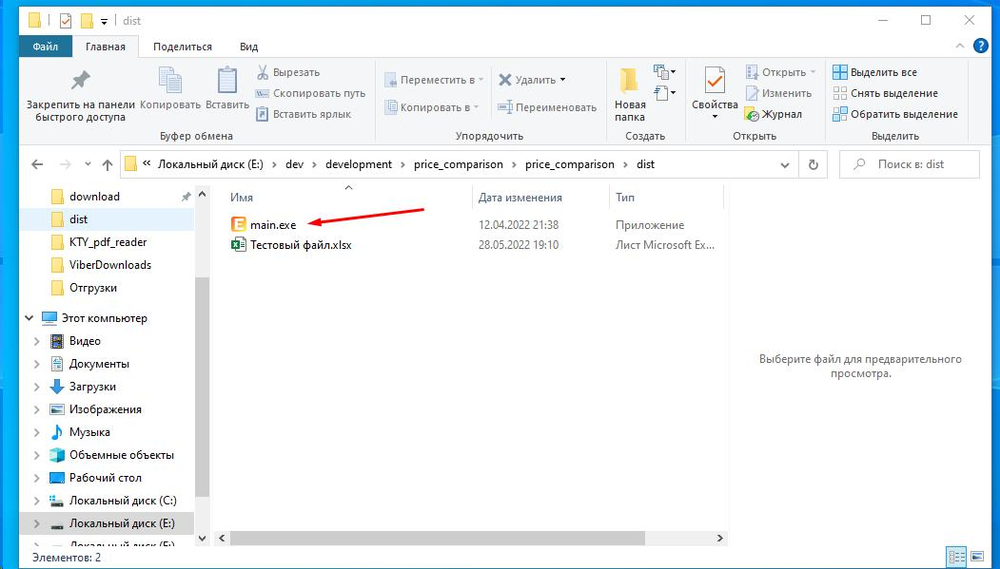
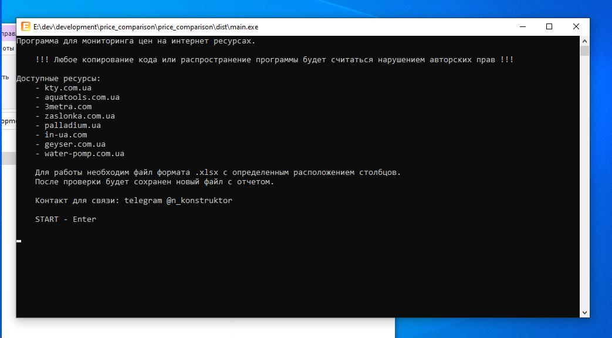
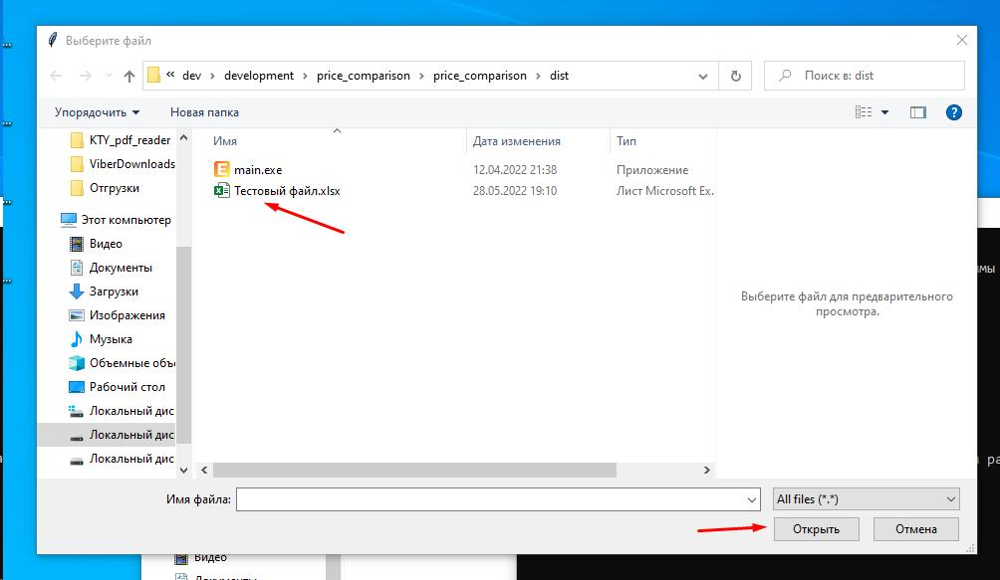
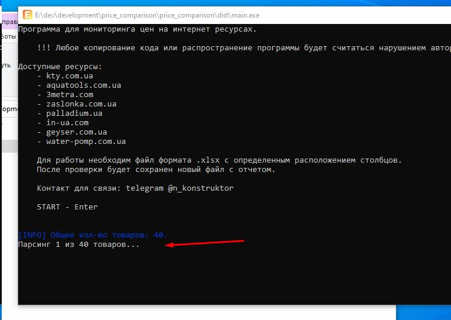
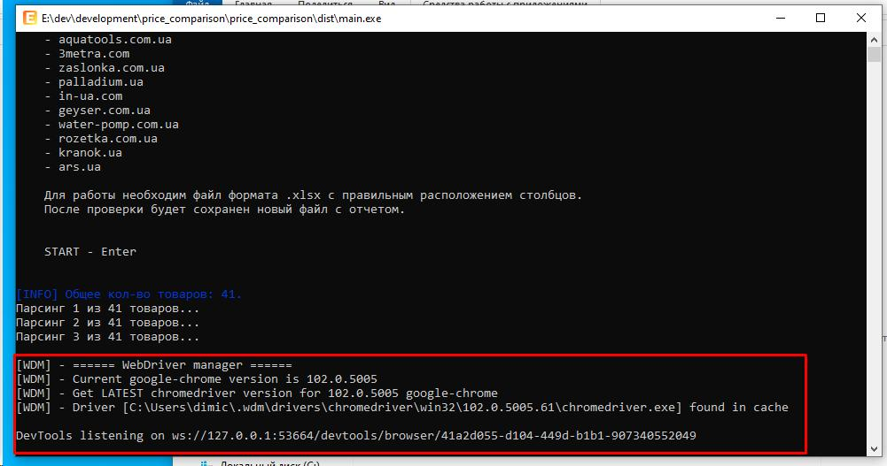
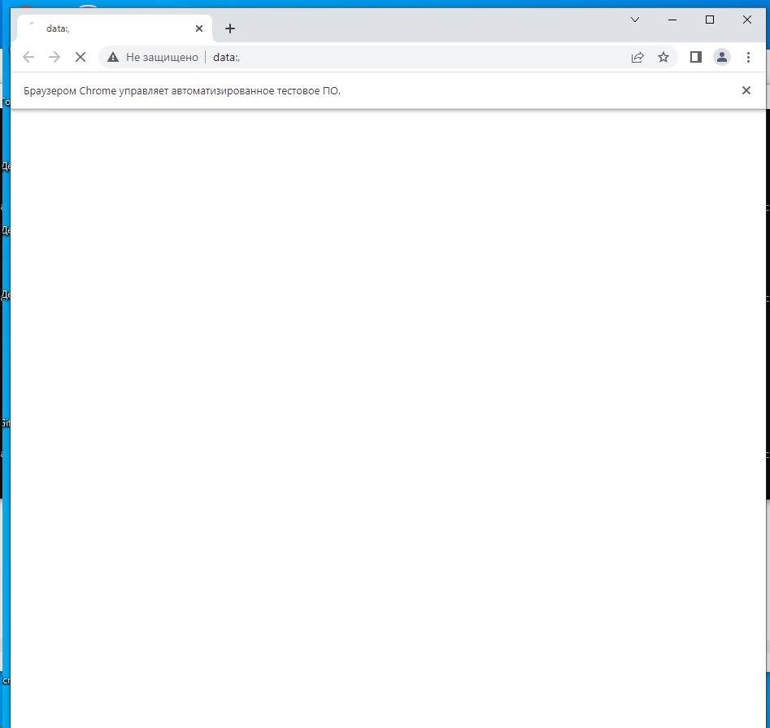
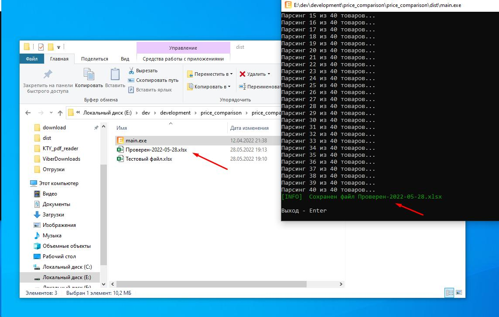
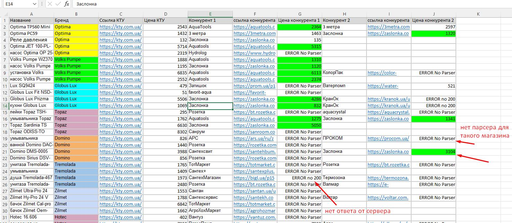

https://nikitariusov.github.io/price_comparison/

# Парсер конкурентов
### Программа для мониторинга цен на интернет ресурсах.
>v.1.02 (11.11.22)

Доступные ресурсы:
1. kty.com.ua
2. aquatools.com.ua
3. 3metra.com
4. zaslonka.com.ua
5. palladium.ua
6. in-ua.com
7. geyser.com.ua
8. water-pomp.com.ua
9. rozetka.com.ua
10. kranok.ua
11. ars.ua
12. santekh.com.ua
13. hydrolog.kiev.ua
14. agrohozmarket.com.ua
15. totmarket.com.ua
16. ovs.com.ua
17. teplovuk.com.ua

# Файлы для загрузки:
1. [Программа](src/download/main.exe)
2. [Тестовый файл](src/download/Тестовый%20файл.xlsx)
2. [Пустой шаблон](src/download/Пустой%20шаблон.xlsx)

# Инструкция:
1. Скачать программу.
2. Из гугл таблицы с товарами скопировать все нужные ячейки и сохранить в Пустой шаблон, 
или воспользоваться старым шаблоном.
3. Запустить файл main.exe - на экране появится командная строка, выведет какой-то текст.
    
    
4. Жмем ентер.
5 Откроется проводник для выбора файла - выбираем файл ексель и жмем Открыть.
    
6. В командной строке появится кол-во товаров и начнется парсинг.
    
7. !!! Если в таблице присутствует магазин КранОк, или к сайту КТУ не будет доступа - то в терминале будет выведена дополнительная сервисная информация. 
Затем запустится автоматизированное окно браузера Хром, трогать его не нужно, оно закроется через 2-3 секунды.
    
    
8. Как будут проверены все товары программа напишет что сохранила новый ексель файл. жмем ентер или просто закрываем окно.
    
9. В новом файле будут стоять цены или вместо цены написана ошибка, например если для какого-нибудь магазина не написан парсер.
10. Цены ниже чем в КТУ будут выделены зеленым цветом.
    
